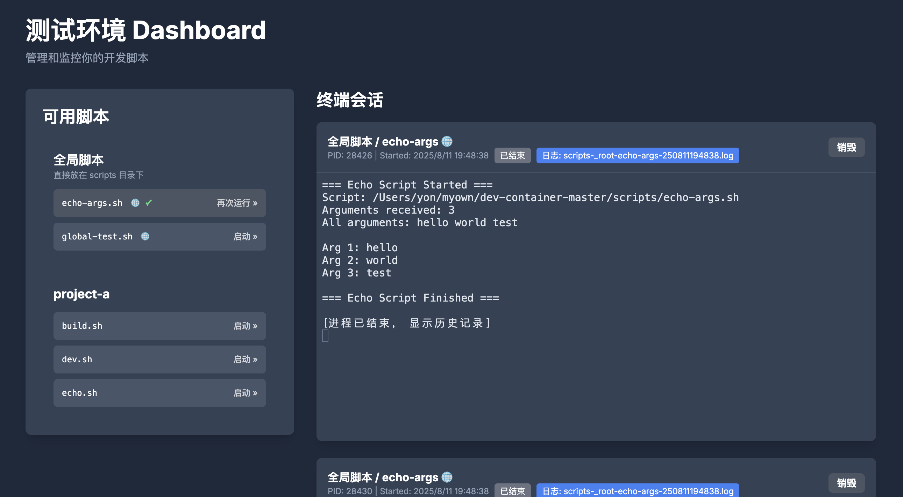

# dev-env-panel

一个强大的开发环境管理面板，让你在浏览器中轻松运行和管理项目脚本！

**🤖 本项目采用 Vibe Coding 完成！**



## ✨ 核心特性

- 🖥️ **交互式终端** - 每个脚本都有独立的浏览器终端界面 (PTY)
- 📝 **完整日志记录** - 自动记录所有脚本输出到日志文件
- 🏗️ **多项目支持** - 同时管理多个项目的脚本
- 🔄 **实时输出** - 通过 WebSocket 实现实时终端交互
- 🌊 **流式接口** - HTTP 流式获取进程输出，支持 Chunked 和 SSE 格式
- ⚡ **脚本单例执行** - 自动管理脚本实例，避免重复运行
- 📊 **进程监控** - 查看所有运行中和历史进程状态
- 🎨 **现代化界面** - 美观易用的 Web 管理界面

## 🚀 快速开始

### 1. 安装依赖

```bash
npm install
```

### 2. 设置项目结构

```
dev-env-panel/
├── workspace/           # 项目工作目录
│   ├── project-a/      # 项目A的代码
│   └── project-b/      # 项目B的代码
├── scripts/            # 脚本目录
│   ├── echo-args.sh    # 根级脚本
│   ├── project-a/      # 项目A的脚本
│   │   ├── build.sh
│   │   └── dev.sh
│   └── project-b/      # 项目B的脚本
│       └── deploy.sh
└── logs/              # 日志输出目录（自动创建）
```

### 3. 启动服务器

```bash
npm start
# 或者
node index.js
```

服务器将在 `http://127.0.0.1:3000` 启动

### 4. 访问管理界面

在浏览器中打开 `http://127.0.0.1:3000`

## 📁 项目结构详解

### 脚本组织方式

**根级脚本** (`scripts/*.sh`)：
- 脚本名：`_root/scriptname`
- 工作目录：`workspace/`
- 适用于：全局工具脚本、系统级操作

**项目脚本** (`scripts/${project}/*.sh`)：
- 脚本名：`${project}/scriptname` 
- 工作目录：`workspace/${project}/`
- 适用于：项目特定的构建、开发、测试脚本

### 环境变量

所有脚本运行时都可以使用以下环境变量：

- `BASE_URL` - 服务器基础URL (默认: `http://127.0.0.1:3000`)
- `WORKSPACE` - 工作空间根目录的绝对路径

### 日志系统

- 日志文件命名：`scripts-${project}-${script}-${YYMMDDHHmmss}.log`
- 日志位置：`logs/` 目录
- 包含完整的脚本输出，包括错误信息

## 🔧 配置选项

通过环境变量配置：

```bash
PORT=3000                           # 服务器端口
SCRIPTS_DIR=/path/to/scripts        # 脚本目录
LOGS_DIR=/path/to/logs             # 日志目录  
WORKSPACE=/path/to/workspace        # 工作空间目录
```

## 📚 HTTP API 参考

### 脚本管理

#### `GET /api/scripts`
获取所有可用脚本列表

**响应示例：**
```json
[
  {
    "repoName": "_root",
    "scriptName": "echo-args", 
    "path": "/path/to/scripts/echo-args.sh",
    "isDirectScript": true
  },
  {
    "repoName": "project-a",
    "scriptName": "build",
    "path": "/path/to/scripts/project-a/build.sh", 
    "isDirectScript": false
  }
]
```

#### `POST /api/scripts/:repoName/:scriptName/start`
启动指定脚本

**请求参数：**
- 路径参数：`repoName`, `scriptName`
- 请求体/查询参数：`arg` (字符串或数组)

**支持的数据格式：**
```bash
# JSON格式
curl -X POST "http://127.0.0.1:3000/api/scripts/project-a/build/start" \
  -H "Content-Type: application/json" \
  -d '{"arg": ["--env", "production"]}'

# 表单格式  
curl -X POST "http://127.0.0.1:3000/api/scripts/project-a/build/start" \
  -d 'arg=--env' -d 'arg=production'

# 查询字符串
curl -X POST "http://127.0.0.1:3000/api/scripts/project-a/build/start?arg=--env&arg=production"
```

**响应示例：**
```json
{
  "pid": 12345,
  "repoName": "project-a", 
  "scriptName": "build",
  "args": ["--env", "production"],
  "message": "脚本启动成功",
  "logFile": "scripts-project-a-build-250101120000.log"
}
```

### 进程管理

#### `GET /api/pty`
获取所有进程列表（包括已结束的）

**响应示例：**
```json
[
  {
    "pid": 12345,
    "repoName": "project-a",
    "scriptName": "build", 
    "args": ["--env", "production"],
    "startTime": "2025-01-01T12:00:00.000Z",
    "isRunning": true,
    "bufferSize": 1024,
    "logFile": "scripts-project-a-build-250101120000.log"
  }
]
```

#### `GET /api/pty/:pid/buffer`
获取进程的输出缓冲区

**响应示例：**
```json
{
  "buffer": "Build started...\nStep 1/5 complete\n",
  "isRunning": true,
  "logFile": "scripts-project-a-build-250101120000.log",
  "args": ["--env", "production"]
}
```

#### `POST /api/pty/:pid/stop`
终止运行中的进程

#### `DELETE /api/pty/:pid`
完全删除进程记录（包括历史）

#### `GET /api/pty/:pid/stream`
流式获取进程输出内容

**查询参数：**
- `includeHistory` (boolean, 可选) - 是否包含历史buffer数据，默认为 `true`
- `sse` (boolean, 可选) - 是否使用SSE格式，默认为 `false` (chunked格式)

**使用示例：**
```bash
# 获取进程实时输出（包含历史，chunked格式）
curl "http://127.0.0.1:3000/api/pty/12345/stream"

# 获取进程实时输出（不含历史）
curl "http://127.0.0.1:3000/api/pty/12345/stream?includeHistory=false"

# 获取进程实时输出（SSE格式）
curl "http://127.0.0.1:3000/api/pty/12345/stream?sse=true"
```

**响应格式：**

*Chunked 格式（默认）：*
- Content-Type: `text/plain; charset=utf-8`
- 数据直接以原始文本形式流式传输

*SSE 格式：*
- Content-Type: `text/event-stream`
- 数据格式：`data: <内容>\n\n`
- 进程结束时发送：`event: close\ndata: Process finished\n\n`

**特性：**
- 🔄 **实时流式传输** - 进程输出立即推送到客户端
- 📜 **历史数据支持** - 可选择包含已有的缓冲区数据
- 🎯 **双格式支持** - 支持标准HTTP Chunked和Server-Sent Events
- 🔌 **自动断开** - 进程退出后流式连接自动关闭
- 🛡️ **错误处理** - 客户端断开时自动清理资源

## 🔌 连接方式对比

### WebSocket 连接（双向交互）

**适用场景：** 需要向终端发送命令的交互式场景

```javascript
const ws = new WebSocket(`ws://127.0.0.1:3000?pid=${pid}`);

// 接收终端输出
ws.onmessage = (event) => {
  console.log('输出:', event.data);
};

// 发送输入到终端
ws.send('ls -la\n');
```

### HTTP 流式接口（单向输出）

**适用场景：** 只需要监听输出，不需要发送命令的场景

```javascript
// 使用 fetch API
const response = await fetch(`http://127.0.0.1:3000/api/pty/${pid}/stream`);
const reader = response.body.getReader();

while (true) {
  const { done, value } = await reader.read();
  if (done) break;
  console.log('输出:', new TextDecoder().decode(value));
}

// 使用 EventSource (SSE)
const eventSource = new EventSource(`http://127.0.0.1:3000/api/pty/${pid}/stream?sse=true`);
eventSource.onmessage = (event) => {
  console.log('输出:', event.data);
};
eventSource.addEventListener('close', () => {
  console.log('进程已结束');
  eventSource.close();
});
```

### 特性对比

| 特性 | WebSocket | HTTP Stream |
|------|-----------|-------------|
| **双向通信** | ✅ 支持 | ❌ 只读 |
| **实时输出** | ✅ 支持 | ✅ 支持 |
| **历史回放** | ✅ 支持 | ✅ 支持 |
| **标准协议** | WebSocket | HTTP/SSE |
| **防火墙友好** | ⚠️ 可能被拦截 | ✅ 更兼容 |
| **断线重连** | 需要手动实现 | ✅ SSE自动重连 |
| **浏览器支持** | ✅ 现代浏览器 | ✅ 所有浏览器 |

## 💡 使用示例

### 脚本编写示例

**构建脚本** (`scripts/project-a/build.sh`)：
```bash
#!/bin/bash
echo "开始构建项目 A..."
echo "工作目录: $(pwd)"
echo "基础URL: $BASE_URL"

# 你的构建逻辑
npm install
npm run build

echo "构建完成！"
```

**开发服务器脚本** (`scripts/project-a/dev.sh`)：
```bash
#!/bin/bash
echo "启动开发服务器..."
echo "面板地址: $BASE_URL"

# 启动开发服务器
npm run dev
```

### 脚本间互相调用

```bash
#!/bin/bash
# 在脚本中调用其他脚本
curl -X POST "${BASE_URL}/api/scripts/project-a/build/start" \
  -d 'arg=--production' \
  -s -q
```

### 流式接口应用场景

**监控构建过程：**
```bash
#!/bin/bash
# 启动构建并实时监控输出
BUILD_RESPONSE=$(curl -X POST "${BASE_URL}/api/scripts/project-a/build/start" -d 'arg=--production')
PID=$(echo $BUILD_RESPONSE | jq -r '.pid')

# 流式获取构建输出
curl "${BASE_URL}/api/pty/${PID}/stream" | while read line; do
  echo "[$(date)] $line"
  # 可以添加自定义逻辑，如错误检测、进度解析等
done
```

**集成到 CI/CD 流水线：**
```bash
#!/bin/bash
# 在 CI 中使用流式接口获取实时日志
start_response=$(curl -X POST "${BASE_URL}/api/scripts/deploy/production/start")
pid=$(echo "$start_response" | jq -r '.pid')

# 实时输出到 CI 日志，不包含历史数据
curl "${BASE_URL}/api/pty/${pid}/stream?includeHistory=false" &
STREAM_PID=$!

# 等待部署完成
wait $STREAM_PID
```

## 🛠️ 高级功能

### 缓冲区管理
- 每个进程维护最大 300,000 字符的输出缓冲区
- 超出限制时自动保留最新内容
- 所有输出都完整记录到日志文件

### 单例执行
- 同名脚本再次启动时会自动终止之前的实例
- 保留历史记录供查看
- 避免资源冲突和重复执行

### 错误处理
- 脚本不存在时返回 404 错误
- 工作空间目录不存在时拒绝执行
- WebSocket 连接异常时自动清理

## 🔍 故障排除

### 常见问题

**脚本未出现在列表中：**
- 检查 `workspace/` 下是否存在对应的项目目录
- 确认脚本文件权限正确 (`chmod +x script.sh`)
- 检查脚本文件名是否以 `.sh` 结尾

**脚本执行失败：**
- 查看日志文件了解详细错误信息
- 确认脚本在对应的工作目录下能正常运行
- 检查环境变量是否正确设置

**WebSocket 连接问题：**
- 确认进程 PID 存在且有效
- 检查浏览器控制台的错误信息
- 验证 WebSocket 连接 URL 格式

### 调试模式

启用详细日志：
```bash
DEBUG=* node index.js
```

## 📄 许可证

MIT License

## 🤝 贡献

欢迎提交 Issue 和 Pull Request！